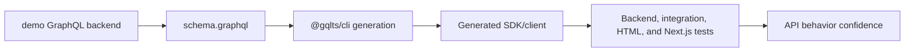

# API Flow

Gqlts does not currently have a dedicated `__api_flow__` folder or a separately named API-flow harness.

The API behavior that matters to generated clients is covered by demo and integration tests:

- `demo-apps/backend`: GraphQL Yoga/Nexus server used as the real API surface.
- `demo-apps/backend/sdk`: generated SDK consumed by backend tests.
- `demo-apps/integration-tests`: operation generation and execution against an in-process GraphQL server.
- `demo-apps/html`: browser bundle and upload flow against the demo backend.
- `demo-apps/next`: CSR, SSR, and API route behavior against the demo backend.

## Flow

## Guidance

- Do not invent an API-flow folder unless a future feature needs a separate harness.
- Keep API behavior coverage in the demo apps and integration tests unless the project explicitly adds `__api_flow__`.
- If a future API-flow harness is added, keep its instructions in this file or a sibling `docs/api-flow/*.md` file and link it from `AGENTS.md`.
- Keep suite names and file names filter-friendly if a dedicated API-flow test set appears later.
