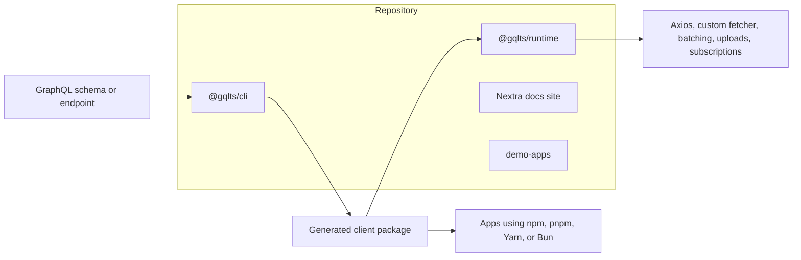
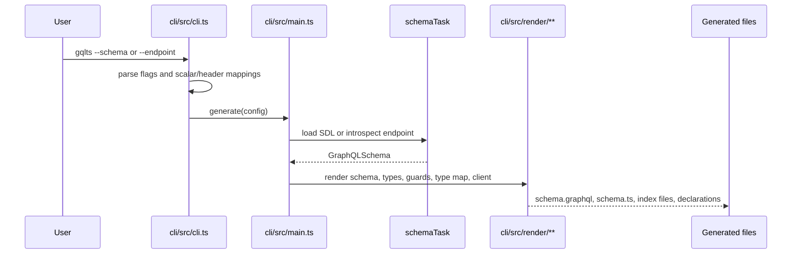
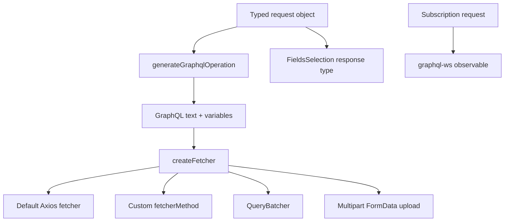
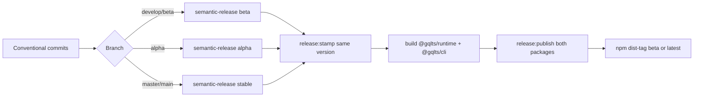

# Architecture

Gqlts is a two-package TypeScript workspace. The CLI reads GraphQL schemas and generates client code. The runtime powers generated clients in Node.js, Bun, browsers, and framework apps.

## Package Map

## Repository Layout

- `cli`: generator package published as `@gqlts/cli`.
- `runtime`: runtime package published as `@gqlts/runtime`.
- `website`: Nextra documentation site.
- `demo-apps/backend`: GraphQL Yoga/Nexus backend used by SDK, upload, browser, and Next.js tests.
- `demo-apps/backend/sdk`: generated SDK package for the backend demo.
- `demo-apps/html`: standalone browser bundle test.
- `demo-apps/next`: Next.js SSR, CSR, and API route test app.
- `demo-apps/integration-tests`: generator and runtime integration tests.
- `demo-apps/try-clients`: generated-client examples for larger schemas and custom fetchers.
- `demo-apps/example-usage`: UI examples for SWR, React Query, Apollo, built-in client, and subscriptions.

## Generation Flow

The generator entrypoints are:

- `cli/src/cli.ts`: command-line flags and config parsing.
- `cli/src/main.ts`: top-level `generate(config)` orchestration.
- `cli/src/tasks/schemaTask.ts`: schema loading from `--schema` or `--endpoint`.
- `cli/src/tasks/clientTasks.ts`: generated file writes.
- `cli/src/render/**`: renderers for response types, request types, type maps, guards, and client entrypoints.

`RenderContext` collects code blocks, tracks generated imports, rewrites relative imports when `config.output` is known, and returns final source text. Renderers should not write files directly.

## Generated Client Shape

A generated client usually contains:

- `schema.graphql`: schema snapshot used for generation.
- `schema.ts`: generated TypeScript schema, request, response, and type guard source.
- `index.js`: CommonJS client entrypoint.
- `index.esm.js`: ES module client entrypoint when ESM output is enabled.
- `index.d.ts`: public generated client types.
- `types.cjs.js` and `types.esm.js`: compressed runtime type map.
- `guards.cjs.js` and `guards.esm.js`: runtime type guards.
- `standalone.js`: optional UMD/browser bundle.

Generated clients export `createClient`, `everything`, operation generators, request/result types, and type guards.

`index.d.ts` is the public package boundary for generated SDKs. It should expose local SDK-owned names for runtime, Axios, WebSocket, and operation types so downstream packages can export inferred clients without TypeScript naming nested dependency paths such as `sdk/node_modules/@gqlts/runtime`.

## Runtime Flow

Runtime entrypoints:

- `runtime/src/client/createClient.ts`: creates query, mutation, and subscription methods.
- `runtime/src/client/generateGraphqlOperation.ts`: converts request objects into `{ query, variables }`.
- `runtime/src/client/typeSelection.ts`: maps selected request fields to response types.
- `runtime/src/client/linkTypeMap.ts`: links generated compressed type maps.
- `runtime/src/fetcher.ts`: default Axios fetcher, custom fetcher hook, batching, and upload handling.
- `runtime/src/extract-files/extract-files.ts`: GraphQL multipart upload extraction.
- `runtime/src/index.ts`: public runtime exports.

## Release Flow

One semantic-release run computes the version, stamps the root, runtime, and CLI manifests, builds both packages, and publishes `@gqlts/runtime` plus `@gqlts/cli` at the same version. Exact branch behavior comes from `.releaserc.json`; keep that file, this diagram, and the release workflow aligned.

## Where To Change Things

- Add or change CLI flags in `cli/src/cli.ts`, then thread them through `Config` in `cli/src/config.ts`.
- Change schema loading in `cli/src/tasks/schemaTask.ts` or `cli/src/schema/fetchSchema.ts`.
- Change generated response TypeScript in `cli/src/render/responseTypes/**`.
- Change request-object syntax in both `cli/src/render/requestTypes/**` and `runtime/src/client/generateGraphqlOperation.ts`.
- Change generated client entrypoints in `cli/src/render/client/renderClient.ts`.
- Change generated declaration types in `cli/src/render/client/renderClientDefinition.ts`; keep public generated SDK types portable for package consumers.
- Change runtime query execution in `runtime/src/fetcher.ts`.
- Change subscription behavior in `runtime/src/client/createClient.ts`.
- Change upload behavior in `runtime/src/extract-files/extract-files.ts` and `runtime/src/fetcher.ts`.
- Change compile-time selected response typing in `runtime/src/client/typeSelection.ts`.
- Change generated demo outputs by rerunning the relevant `gen` or `build-sdk` command and committing the resulting generated files.
