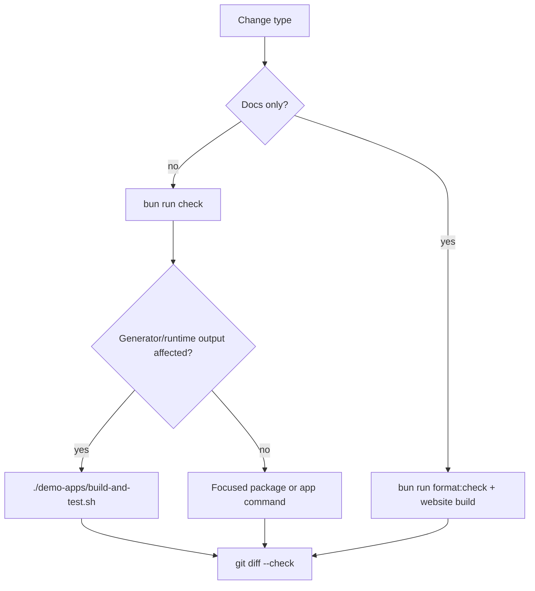

# Testing

Use the smallest test set that covers the behavior you changed, then run `git diff --check`.

## Default Commands

```sh
bun run format:check
bun run lint
bun run typecheck
bun run test
bun run --cwd website build
```

`bun run check` runs formatting, linting, typechecking, and package tests. It is the normal local gate for code changes.

## Test Flow



## Coverage Map

- `cli/src/helpers/parse.test.ts`: CLI flag parsing helpers.
- `cli/src/helpers/printHelp.test.ts`: package-manager install guidance for npm, pnpm, Yarn, and Bun.
- `cli/src/render/common/__tests__/**`: render context, comments, and basic typing renderer behavior.
- `cli/src/render/requestTypes/index.test.ts`: request-object type rendering.
- `cli/src/render/schema/renderSchema.test.ts`: printed schema output.
- `cli/src/render/typeMap/index.test.ts`: compressed type map output.
- `runtime/src/client/__tests__/typeSelection.test.ts`: compile-time response selection behavior.
- `runtime/src/client/__tests__/createClient.test.ts`: subscription client options and explicit WebSocket implementation handling.
- `runtime/src/client/__tests__/generateGraphqlOperation.test.ts`: generated GraphQL operation strings.
- `demo-apps/integration-tests/tests/simple.ts`: generated operation strings and snapshots.
- `demo-apps/integration-tests/tests/execution.ts`: query, mutation, batching, headers, and subscription execution against an in-process server.
- `demo-apps/backend/__tests__/0001-say-hello.test.ts`: backend SDK flow, headers, and upload behavior.
- `demo-apps/html/puppeteer-test.js`: standalone browser bundle behavior and file uploads.
- `demo-apps/next/ui-test/puppeteer-test.js`: Next.js CSR, SSR, and API route behavior.
- `demo-apps/try-clients/tests/**`: larger schemas, custom fetchers, batching, and token-gated GitHub examples.

## Change Checklist

- CLI renderer changes: run `bun run --cwd cli test`, `bun run buildall`, and `bun run --cwd demo-apps/integration-tests gen`.
- Runtime fetcher or query changes: run `bun run --cwd runtime test`, `bun run --cwd demo-apps/integration-tests test`, and `./demo-apps/build-and-test.sh`.
- Subscription changes: run runtime tests, integration tests, and a Bun or Node smoke check when changing `webSocketImpl`.
- Upload changes: run `./demo-apps/build-and-test.sh`; the HTML bundle covers browser uploads.
- Next.js or SSR changes: run `bun run --cwd demo-apps/next build` and `./demo-apps/build-and-test.sh`.
- Docs changes: run `bun run format:check` and `bun run --cwd website build`.
- Dependency updates: run `bun run buildall`, `bun run test`, `bun run typecheck`, `./demo-apps/build-and-test.sh`, and package-specific builds for changed demo apps.

## Full Demo Procedure

Run this before pushing changes that touch generator output, runtime behavior, uploads, subscriptions, SDK generation, or Next.js behavior:

```sh
./demo-apps/build-and-test.sh
```

The script runs:

1. Workspace install and schema generation through Bun's TypeScript runtime.
2. Backend SDK generation.
3. Backend typecheck, build, production schema generation, and Bun tests.
4. Standalone HTML bundle tests against the backend.
5. Next.js app tests in dev mode.
6. Next.js production build and tests against `next start`.
7. Integration generation and tests.

## Troubleshooting

- If `tsgo` reports `TS5011`, add an explicit `rootDir` to the `tsconfig.json` used by that package.
- If `describe`, `it`, `fs`, `path`, `process`, or `__dirname` are missing during typecheck, import test helpers from `bun:test`, install `@types/bun` and `@types/node` in that package, and add `"types": ["bun", "node"]` to its `tsconfig.json`.
- If Next.js warns about multiple lockfiles, verify there is no stray package-manager lockfile under a demo app. The repo should keep `bun.lock` at the root only.
- If subscription tests fail in Node, verify that a WebSocket implementation is available. Node and Bun may expose global `WebSocket`; otherwise pass `webSocketImpl` explicitly.
