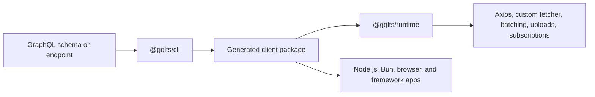
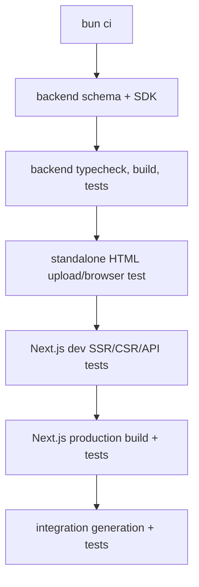

# Contributing and architecture

This page explains how the repository is organized, how generated clients are built, and which commands to run before shipping changes.

The canonical repo-maintainer docs live in [`DEVELOPMENT.md`](https://github.com/meabed/gqlts/blob/master/DEVELOPMENT.md), [`docs/architecture.md`](https://github.com/meabed/gqlts/blob/master/docs/architecture.md), and [`docs/testing.md`](https://github.com/meabed/gqlts/blob/master/docs/testing.md).

## Repository structure

Gqlts has two published workspace packages and several demo apps that behave like real consumers.

- `cli`: generator package published as `@gqlts/cli`.
- `runtime`: runtime package published as `@gqlts/runtime`.
- `website`: this Nextra documentation site.
- `demo-apps/backend`: GraphQL Yoga/Nexus backend used by SDK, upload, browser, and Next.js tests.
- `demo-apps/backend/sdk`: generated SDK package for the backend demo.
- `demo-apps/html`: standalone browser bundle test.
- `demo-apps/next`: Next.js SSR, CSR, and API route test app.
- `demo-apps/integration-tests`: generator and runtime integration tests.
- `demo-apps/try-clients`: generated-client examples for larger schemas and custom fetchers.
- `demo-apps/example-usage`: UI examples for SWR, React Query, Apollo, built-in client, and subscriptions.

## Architecture at a glance



## Published packages

### CLI

`@gqlts/cli` loads a schema and writes a generated client directory. It is used from `gqlts`, `npx gqlts`, `pnpm dlx gqlts`, `yarn gqlts`, `bunx gqlts`, or the programmatic `generate(config)` API.

- `cli/src/cli.ts`: command-line flags and config parsing.
- `cli/src/main.ts`: top-level `generate(config)` orchestration.
- `cli/src/tasks/schemaTask.ts`: schema loading from `--schema` or `--endpoint`.
- `cli/src/tasks/clientTasks.ts`: output file tasks.
- `cli/src/render/**`: renderers for response types, request types, type maps, guards, and client entrypoints.

### Runtime

`@gqlts/runtime` is imported by generated clients. It handles operation generation, runtime execution, upload detection, batching, subscriptions, and type-map linking.

- `runtime/src/client/createClient.ts`: creates query, mutation, and subscription methods.
- `runtime/src/client/generateGraphqlOperation.ts`: converts request objects into `{ query, variables }`.
- `runtime/src/client/typeSelection.ts`: maps selected request fields to response types.
- `runtime/src/client/linkTypeMap.ts`: links generated compressed type maps.
- `runtime/src/fetcher.ts`: default Axios fetcher, custom fetcher hook, batching, and upload handling.
- `runtime/src/extract-files/extract-files.ts`: GraphQL multipart upload extraction.
- `runtime/src/index.ts`: public runtime exports.

## Code flow

### Generation flow

The generator starts from either the CLI command or the programmatic `generate(config)` API.

1. `cli/src/cli.ts` parses flags such as `--schema`, `--endpoint`, `--output`, `--esm`, `--esm-and-cjs`, `--sort`, `-H`, and `-S`.
2. `cli/src/tasks/validateConfigs.ts` rejects missing or conflicting schema sources.
3. `cli/src/main.ts` creates the Listr pipeline.
4. `cli/src/tasks/schemaTask.ts` loads a schema from SDL or endpoint introspection.
5. `cli/src/tasks/clientTasks.ts` creates the output directory and writes the generated files.
6. Renderers add code into `RenderContext`; file writes stay centralized in the task layer.

`RenderContext` collects code blocks, tracks generated imports, rewrites relative imports when `config.output` is known, and returns the final code string.

### Renderer map

- `cli/src/render/schema/renderSchema.ts`: prints `schema.graphql`.
- `cli/src/render/responseTypes/**`: renders response interfaces, unions, enums, aliases, and scalars.
- `cli/src/render/requestTypes/**`: renders the typed request-object API.
- `cli/src/render/typeGuards/renderTypeGuards.ts`: renders `is<TypeName>` guards.
- `cli/src/render/typeMap/**`: renders the compressed runtime type map.
- `cli/src/render/client/renderClient.ts`: renders CJS and ESM entrypoints.
- `cli/src/render/client/renderClientDefinition.ts`: renders `index.d.ts`.
- `cli/src/render/common/renderTyping.ts`: converts GraphQL nullability and list types into TypeScript syntax.

The type map renderer builds a readable string-keyed map and compresses type names into indexes. The runtime links that map back into objects with `linkTypeMap`. If generated query paths are wrong, inspect both `renderTypeMap` and `linkTypeMap`.

### Runtime query flow

Generated entrypoints import runtime helpers, link the generated type map, and expose `createClient`.

1. Generated `createClient` injects `queryRoot`, `mutationRoot`, and `subscriptionRoot`.
2. Runtime `createClient` creates `query`, `mutation`, and `subscription` methods.
3. Query and mutation calls use `generateGraphqlOperation`.
4. `runtime/src/fetcher.ts` executes through Axios, a custom `fetcherMethod`, multipart upload, or `QueryBatcher`.
5. Subscription calls create a `graphql-ws` client lazily and return a `zen-observable-ts` observable.

### Request object syntax

- `{ field: true }` selects a field.
- `{ field: false }` or `{ field: 0 }` excludes a field.
- `{ field: { nested: true } }` selects nested fields.
- `{ field: [{ arg: value }, { nested: true }] }` passes arguments.
- `{ __scalar: true }` expands scalar fields.
- `{ __name: 'OperationName' }` names the operation.
- `{ __alias: { aliasName: { field: selection } } }` renders GraphQL field aliases.
- `{ on_TypeName: { field: true } }` renders a fragment for unions and interfaces.

Arguments become generated GraphQL variables such as `v1` and `v2`. Operation generators return `{ query, variables }`, which can be executed by the built-in client or passed to Apollo, urql, fetch, Axios, or another client.

### Type selection flow

`runtime/src/client/typeSelection.ts` maps request objects to response types through `FieldsSelection<SRC, DST>`.

Important behaviors:

- tuple requests unwrap `[args, fields]`;
- falsy request values are removed;
- scalar source fields return the scalar type;
- arrays recurse into the array item type;
- `__scalar` picks scalar fields plus explicitly requested nested fields;
- union/interface selections preserve generated union typing and remove helper fields like `__isUnion`.

## Generated output

A generated client usually contains:

- `schema.graphql`: schema snapshot used for generation.
- `schema.ts`: generated TypeScript schema, request, response, and type guard source.
- `index.js`: CommonJS client entrypoint.
- `index.esm.js`: ES module client entrypoint when ESM output is enabled.
- `index.d.ts`: public generated client types.
- `types.cjs.js` and `types.esm.js`: compressed runtime type map.
- `guards.cjs.js` and `guards.esm.js`: runtime type guards.
- `standalone.js`: optional UMD/browser bundle.

The generated client exports `createClient`, `everything`, operation generators, request/result types, and type guards.

## Runtime behavior

The default client uses Axios. You can pass any Axios request config to query and mutation calls, or replace the transport with `fetcherMethod`.

Headers can be static or a function:

```ts
const client = createClient({
  url: 'https://api.example.com/graphql',
  headers: async () => ({
    Authorization: `Bearer ${await getToken()}`,
  }),
});
```

Batching is enabled with `batch: true` or with explicit options:

```ts
const client = createClient({
  url: 'https://api.example.com/graphql',
  batch: {
    batchInterval: 40,
    maxBatchSize: 10,
  },
});
```

Subscriptions use `graphql-ws` and return observables. Browser, Node, and Bun clients can pass an explicit `webSocketImpl`. The runtime validates the shape before passing it through so SSR does not receive invalid browser-only values.

```ts
const client = createClient({
  url: 'http://localhost:4000/graphql',
  subscription: {
    url: 'ws://localhost:4000/graphql',
  },
  webSocketImpl: WebSocket,
});
```

In Next.js SSR, create subscription clients only inside code paths that subscribe. Avoid reading `window.WebSocket` during module initialization.

## Setup

Use Bun from the repo root.

```sh
bun ci
```

The repository uses Bun for local development and CI speed. Published packages still work for npm, pnpm, Yarn, and Bun consumers. `bun.lock` is the only committed package-manager lockfile.

## Build and test commands

Root checks:

```sh
bun run buildall
bun run test
bun run typecheck
bun run lint
bun run format:check
```

Package checks:

```sh
bun run --cwd runtime build
bun run --cwd runtime test
bun run --cwd cli build
bun run --cwd cli test
bun run --cwd website build
```

Backend demo and SDK:

```sh
bun run --cwd demo-apps/backend dev
bun run --cwd demo-apps/backend build-sdk
bun run --cwd demo-apps/backend typecheck
bun run --cwd demo-apps/backend build
bun run --cwd demo-apps/backend start
bun run --cwd demo-apps/backend test
```

Integration and generated-client examples:

```sh
bun run --cwd demo-apps/integration-tests gen
bun run --cwd demo-apps/integration-tests test
bun run --cwd demo-apps/try-clients build
bun run --cwd demo-apps/try-clients test
```

## Full demo CI procedure



Run this before pushing changes that touch generator output, runtime behavior, uploads, subscriptions, SDK generation, or Next.js behavior:

```sh
./demo-apps/build-and-test.sh
```

The script runs:

1. Workspace install and schema generation through Bun's TypeScript runtime.
2. Backend SDK generation.
3. Backend typecheck, build, production schema generation, and Bun tests.
4. Standalone HTML bundle tests against the backend.
5. Next.js app tests in dev mode.
6. Next.js production build and tests against `next start`.
7. Integration generation and tests.

## Release workflow

Gqlts uses `semantic-release` for coordinated releases of `@gqlts/runtime` and `@gqlts/cli`. One release run computes the next version from conventional commits, stamps both package manifests, builds, and publishes both packages at the same version.

Useful commands:

```sh
bun run release:verify
bun run release:dry
bun run release:local 3.5.0-beta.1 --dry-run --tag beta
```

Branch behavior:

- `develop` publishes `x.y.z-beta.n` to npm `beta`.
- `beta` publishes prereleases to npm `beta`.
- `alpha` publishes prereleases to npm `alpha`.
- `master` and `main` publish stable `x.y.z` releases to npm `latest`.
- release CI is driven by branch merges and semantic-release tags, not committed version files.
- `NPM_TOKEN` is required for npm publish. The built-in `GITHUB_TOKEN` is used for tags and GitHub releases.

Contributor rules:

- write release-worthy changes with conventional commit types (`feat`, `fix`, `perf`, `refactor`, or `revert`);
- use non-release types for docs, tests, chores, CI, build-only, and formatting changes;
- do not edit package versions manually in feature PRs;
- keep `@gqlts/runtime` and `@gqlts/cli` version-locked. The stamp script also updates the CLI dependency on `@gqlts/runtime`.

## Test coverage map

- `cli/src/helpers/parse.test.ts`: CLI flag parsing helpers.
- `cli/src/render/common/__tests__/**`: render context, comments, and basic typing renderer behavior.
- `cli/src/render/requestTypes/index.test.ts`: request-object type rendering.
- `cli/src/render/schema/renderSchema.test.ts`: printed schema output.
- `cli/src/render/typeMap/index.test.ts`: compressed type map output.
- `runtime/src/client/__tests__/typeSelection.test.ts`: compile-time response selection behavior.
- `runtime/src/client/__tests__/createClient.test.ts`: subscription client options and explicit WebSocket implementation handling.
- `demo-apps/integration-tests/tests/simple.ts`: generated operation strings and snapshots.
- `demo-apps/integration-tests/tests/execution.ts`: query, mutation, batching, headers, and subscription execution against an in-process server.
- `demo-apps/backend/__tests__/0001-say-hello.test.ts`: backend SDK flow, headers, and upload behavior.
- `demo-apps/html/puppeteer-test.js`: standalone browser bundle behavior and file uploads.
- `demo-apps/next/ui-test/puppeteer-test.js`: Next.js CSR, SSR, and API route behavior.
- `demo-apps/try-clients/tests/**`: larger schemas, custom fetchers, batching, and token-gated GitHub examples.

## Where to change things

- Add or change CLI flags in `cli/src/cli.ts`, then thread them through `Config` in `cli/src/config.ts`.
- Change schema loading in `cli/src/tasks/schemaTask.ts` or `cli/src/schema/fetchSchema.ts`.
- Change generated response TypeScript in `cli/src/render/responseTypes/**`.
- Change request-object syntax in both `cli/src/render/requestTypes/**` and `runtime/src/client/generateGraphqlOperation.ts`.
- Change generated client entrypoints in `cli/src/render/client/renderClient.ts`.
- Change generated declaration types in `cli/src/render/client/renderClientDefinition.ts`.
- Change runtime query execution in `runtime/src/fetcher.ts`.
- Change subscription behavior in `runtime/src/client/createClient.ts`.
- Change upload behavior in `runtime/src/extract-files/extract-files.ts` and `runtime/src/fetcher.ts`.
- Change compile-time selected response typing in `runtime/src/client/typeSelection.ts`.
- Change generated demo outputs by rerunning the relevant `gen` or `build-sdk` command and committing the resulting generated files.

## Change checklist

- CLI renderer changes: run `bun run --cwd cli test`, `bun run buildall`, and `bun run --cwd demo-apps/integration-tests gen`.
- Runtime fetcher or query changes: run `bun run --cwd runtime test`, `bun run --cwd demo-apps/integration-tests test`, and `./demo-apps/build-and-test.sh`.
- Subscription changes: run runtime tests, integration tests, and a Bun or Node smoke check when changing `webSocketImpl`.
- Upload changes: run `./demo-apps/build-and-test.sh`; the HTML bundle covers browser uploads.
- Next.js or SSR changes: run `bun run --cwd demo-apps/next build` and `./demo-apps/build-and-test.sh`.
- Docs changes: run `bun run --cwd website build`.
- Dependency updates: run `bun run buildall`, `bun run test`, `bun run typecheck`, `./demo-apps/build-and-test.sh`, and package-specific builds for changed demo apps.

Always finish with:

```sh
git diff --check
```

## Troubleshooting

If tsgo reports `TS5011`, add an explicit `rootDir` to the `tsconfig.json` used by that package.

If `describe`, `it`, `fs`, `path`, `process`, or `__dirname` are missing during typecheck, import test helpers from `bun:test`, install `@types/bun` and `@types/node` in that package, and add `"types": ["bun", "node"]` to its `tsconfig.json`.

If Next.js warns about multiple lockfiles, verify there is no stray package-manager lockfile under a demo app. The repo should keep `bun.lock` at the root only.
